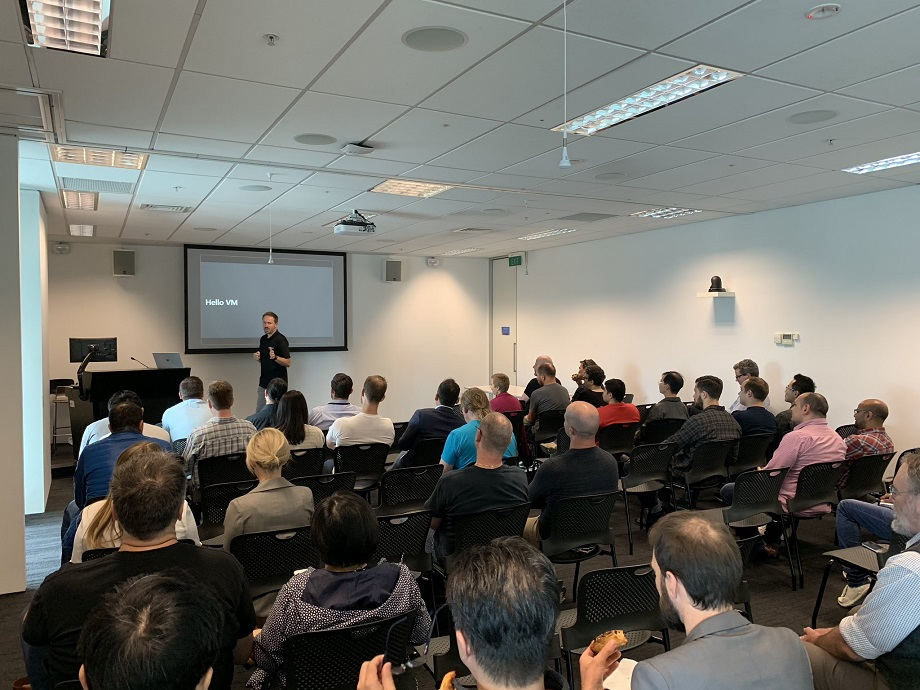

# Operating Azure at scale



It’s really easy to get started quickly and go fast with Azure. But what happens when the business
starts asking for compliance, security and cost control? In the past this has meant slowing down and
implementing large and complex governance frameworks. But now you can have control and go fast with
a suite of Azure Governance services and features that were announced at Ignite 2018: Azure Blueprints,
Resource Graph, Management Groups and Azure Policy (ARM Policies).

In this talk, Daniel Larsen (Technical Evangelist at Microsoft) will demonstrate the new Azure
Governance features in the Azure Portal and CLI (Command line interface), and how to quickly implement
pragmatic and sensible policies and controls that keep the business happy without slowing developers
down. These great new features have drawn from field experience with some of Azure’s largest customers,
so that everyone can benefit from the right amount of control and go fast.

> Slides: [Azure-Governance-2018 (4).pdf](./Azure-Governance-2018%20(4).pdf)

> Video: <https://azurelunchnz.azureedge.net/podcasts/meetup20181024.mp4>

> Azure Governance, a developer's journey - Podcast: <https://github.com/DanielLarsenNZ/azure-lunch/blob/master/podcasts/s1e04.md> 

> Meetup page: <https://www.meetup.com/Auckland-Azure-Lunchtime-Meetup/events/253772141/>

## Runsheet

    00  Intro, the problem
    10  Azure Management Groups, Subscription models, AAD, RBAC
    20  Azure Policy
    30  Azure Blueprints
    40  Azure Resource Graph
    50  Example of a roadmap, see also and wrap

## Prep

1. Open Developer Command Prompt for `az cli` in Desktop 2, `cd c:\r`
1. Open https://shell.azure.com in a tab on Desktop 2
1. Prime the CLI queries in Command prompt and Azure Cloud Shell
1. Open https://ms.portal.azure.com in a tab
1. Open https://ms.portal.azure.com in a Firefox tab as daniel@larsen
1. New VM wizard in a Tab

## Intro

"Automate and Codify"

"Creating more subscriptions"

"Hub & spoke"

### Hello VM bit

1. New VM Wizard
1. Create RG = Subscription owner / contributor
1. Dictionary password + public RDP = pwnd
1. DS2_v2 vs DS2_v3 diff = NZ$44/mo (in my dev/test subscription)

## Management Groups & Subscription modeling

                        Division
                            |
            --------------------------
            |            |           |
        Sandbox Pre-production  Production

### Management Group Demo

1. Walkthrough my Management Groups

### Management Group Notes

* You can move subscriptions into a new Management Group if you change your mind later on.
* Up to six levels deep

### Management Group Links

Organize your resources with Azure management groups: <https://docs.microsoft.com/en-nz/azure/governance/management-groups/index>


## Policy

### Runsheet

    Assign built-in policy definition
    Exceptions
    Custom policy definition
    Compliance
    Remediation

More

    Policy in Portal
    simple if/then statement
    audit, deny, append
    deploy if not exists, audit if not exists
    By Tag, By SKU, By Region

### Notes

* VM guest policies
* 2 policy engines: deployment and compliance
* See the [Azure Governance deep dive] for detailed information
* Azure policy repo: <https://github.com/azure/azure-policy>

### Azure Policy links

Github repo including samples: <https://github.com/azure/azure-policy>

#### VM Guest Policy links

Understand Azure Policy's Guest Configuration: <https://docs.microsoft.com/en-us/azure/governance/policy/concepts/guest-configuration>

Guest config uses DSC v2 on Windows and Chef Inspec on Linux: <https://www.chef.io/inspec/>

Chef InSpec now available in Azure Cloud Shell: <https://blog.chef.io/2018/05/23/inspec-now-available-in-azure-cloud-shell/>

## Azure Blueprints

Tying it all together is Azure Blueprints. An amazing new feature set that was previewed Ignite.

* Blueprints are stored in a Management Group in the heirarchy
* The Blueprint can be _assigned_ to any Subscription that is a child of the Management Group
* You choose at assignment time which Subscription you want to assign the Blueprint to
* All of this can be automated with PowerShell and Azure DevOps. See the [Azure Governance deep dive]
  for detailed information
* A single blueprint can have multiple Published versions that can each be assigned to subscriptions
* Parameters can be dynamic (set at assignment time) or static
* Azure Blueprints uses a sequencing order (which you can adjust) to determine the order of resource
  creation when processing the assignment of a blueprint

### Demos

1. Create a global Blueprint
    1. Environment tag
    1. Assign SysOps group as Contributor
    1. Create Shared Infrastructure RG with KV (Key Vault) and auto (Automation account)
1. Create a Prod Blueprint
    1. Policy: Require Blob encryption for Storage account
    1. RG: app-prod-rg
        1. Apply `project-code` tag with default value to resources and RGs
        1. Add App Team as contributor
1. Demo RBAC for daniel@larsen

### Links

Define and Assign an Azure Blueprint in the portal: <https://docs.microsoft.com/en-us/azure/governance/blueprints/create-blueprint-portal>

Understand the life-cycle of an Azure Blueprint: <https://docs.microsoft.com/en-us/azure/governance/blueprints/concepts/lifecycle>

Understand the deployment sequence in Azure Blueprints: <https://docs.microsoft.com/en-us/azure/governance/blueprints/concepts/sequencing-order>

Alex Frankel's ARM templates that he uses for testing Blueprints: <https://github.com/ajf214/personal-arm-templates>

<https://www.powershellgallery.com/packages/Manage-AzureRMBlueprint/1.0>

## Resource Graph

> <https://shell.azure.com/>

```bash
# count all resources that you have access to
az graph query -q "summarize count()"

# count all resources by subscriptionId
az graph query -q "summarize count() by subscriptionId"

# all VMS, project basic properties
az graph query -q 
    "where type =~ 'Microsoft.Compute/virtualMachines' 
    | project name, os=properties.storageProfile.osDisk.osType, tags, subscriptionId"

# all VMs with an expiry-date stamp less-than or equal-to today
az graph query -q 
    "where type =~ 'Microsoft.Compute/virtualMachines' 
        and tags['expiry-date'] <= 20181020 
    | project name, os=properties.storageProfile.osDisk.osType, tags, subscriptionId"

# all resources with no project-code tag, ordered by resourceGroup
az graph query -q 
    "where isempty(tags['project-code']) and subscriptionId hasprefix '60d45c6e' 
    | project name, resourceGroup, type 
    | order by resourceGroup"

# all VMs that don't have a _v3 SKU
az graph query -q 
    "where type =~ 'Microsoft.Compute/virtualMachines' 
        and aliases['Microsoft.Compute/virtualMachines/sku.name'] !hassuffix '_v3'  
    | project name, resourceGroup, subscriptionId, 
        SKU=aliases['Microsoft.Compute/virtualMachines/sku.name']" 
    --output table

# you can put `--output table` query command to output as a table, e.g.
az graph query -q 
    "where type =~ 'Microsoft.Compute/virtualMachines' 
    | project name, os=properties.storageProfile.osDisk.osType, tagExpiryDate=tags['expiry-date'], subscriptionId" 
    --output table
```

Prime the CLI

```bash
az graph query -q "where type =~ 'Microsoft.Compute/virtualMachines' and aliases['Microsoft.Compute/virtualMachines/sku.name'] !hassuffix '_v3'  | project name, resourceGroup, subscriptionId, SKU=aliases['Microsoft.Compute/virtualMachines/sku.name']" --output table
az graph query -q "where isempty(tags['project-code']) and subscriptionId hasprefix '60d45c6e' | project name, resourceGroup, type | order by resourceGroup"
az graph query -q "where type =~ 'Microsoft.Compute/virtualMachines' and tags['expiry-date'] <= 20181020 | project name, os=properties.storageProfile.osDisk.osType, tags, subscriptionId"
az graph query -q "where type =~ 'Microsoft.Compute/virtualMachines' | project name, os=properties.storageProfile.osDisk.osType, tags, subscriptionId"
az graph query -q "where type =~ 'Microsoft.Compute/virtualMachines' | top 1 by name"
az graph query -q "summarize count() by subscriptionId"
az graph query -q "summarize count()"
```
### Links

Sample queries: <https://docs.microsoft.com/en-nz/azure/governance/resource-graph/samples/starter>

## Maturity model

> WIP

Automation
Management Group
Virtual Datacenter
ARM, IaC
Blueprints
Shared infrastructure
Prod + Non-prod Subscriptions
App per Subscription
Hub and Spoke


        AAD backed
        Work accounts only, MFA on
        Guest access (B2B) for suppliers, contractors, partners
        AAD Groups assigned to Roles
    Prod and Non-prod subscriptions

## Questions

1. Can't add Visual Studio subscription to management group?
1. Can't apply initiatives (as artifacts) to Blueprints?
1. Is it possible / will it be possible to query resource groups?
1. If I remove a policy from a Blueprint definition (that has already been assigned to a Subscription)
   and then update the assignment, will the policy be removed? 
   **Answer**: [The policy will be removed](https://docs.microsoft.com/en-us/azure/governance/blueprints/how-to/update-existing-assignments#rules-for-updating-assignments).
1. Can you clarify the behaviour or deploying an ARM template, which is processed through the resource
   manager as a PUT. Will this perform an incremental or complete deployment?

## More links

<https://docs.microsoft.com/en-us/azure/governance/>

BRK3062 - Architecting Security and Governance Across your Azure Subscriptions: <https://myignite.techcommunity.microsoft.com/sessions/64711?source=sessions>

BRK3085 - Deep dive into Implementing governance at scale through Azure Policy: <https://myignite.techcommunity.microsoft.com/sessions/65631>

Azure Virtual Datacenter and the Enterprise Control Plane: <https://docs.microsoft.com/en-us/azure/architecture/vdc/>

<https://www.youtube.com/watch?v=3Di9H1V0zuc> 

<https://www.youtube.com/watch?v=nxGwFDpVGjM> 

<https://www.youtube.com/watch?v=OiOXlgFNgDo>

<https://azure.microsoft.com/en-us/resources/videos/ignite-2018-building-a-scalable-solution-to-millions-of-users-lessons-learned-from-the-microsoft-azure-portal-team/>

<https://azure.microsoft.com/en-us/resources/videos/ignite-2018-azure-it-controls-for-automation-and-configurations-of-your-azure-and-on-prem-environment/>

<https://azure.microsoft.com/en-us/resources/videos/ignite-2018-building-cloud-apps-using-the-secure-devops-kit-for-azure/>

<https://azure.microsoft.com/en-us/resources/videos/ignite-2018-implementing-devops-secure-and-compliant-by-default/>

<https://azure.microsoft.com/en-us/resources/videos/ignite-2018-cloud-governance-at-microsoft-through-azure-policy-management-groups-and-the-azure-secure-devops-kit/>


[Azure Governance deep dive]:https://myignite.techcommunity.microsoft.com/sessions/65631