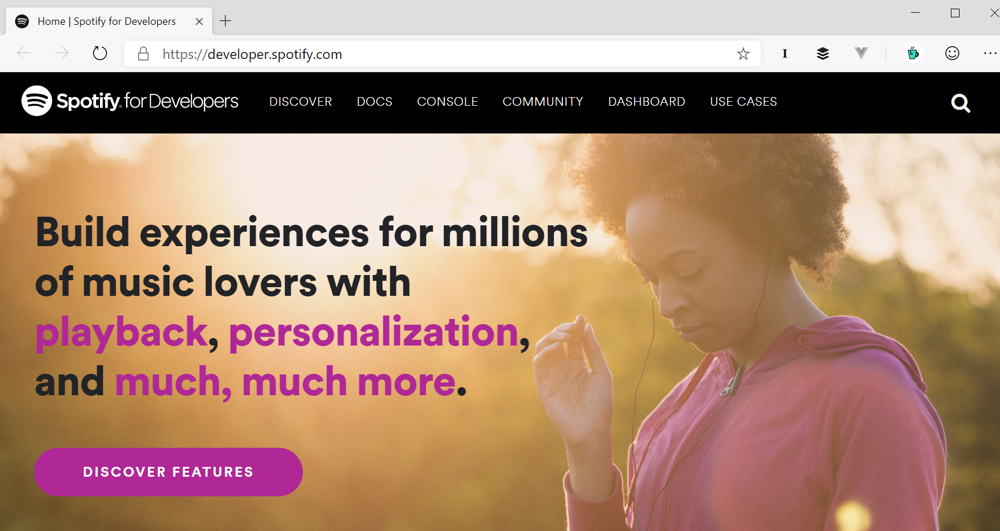

# Hacking on the Spotify API



By "Hacking" I mean the Hacker subculture definition: <https://en.wikipedia.org/wiki/Hacker_culture#Definition>

_"A person who enjoys exploring the details of programmable systems and stretching their capabilities"_

## Hi everyone!

This talk is about Hacking as in exploring.

Spotify API is well formed. Good example of a RESTful API.

Handy teaching aid for API's, Identity and how to orchestrate multiple services into a product.

Most people listen to music and can name their favourite artist or song. And some people are very
passionate about music. It's a good domain to work in for demos and samples.

## Tabbed slideshow

<https://developer.spotify.com/>

<https://developer.spotify.com/documentation/web-api/>

<https://developer.spotify.com/documentation/web-api/reference/search/search/>

<https://developer.spotify.com/console/get-search-item/?q=radiohead&type=artist&market=&limit=&offset=>

<https://developer.spotify.com/console/put-play/>

## Putting it all together in a script

Write your own x-plat Spotify CLI with PowerShell Core.

Invoke from PowerShell: 

```powershell
# alias the script to the word `spotify`
alias spotify .\spotify.ps1

# set the SPOTIFY_BEARER_TOKEN environment variable. 
#  In this simple implementation this needs to be done once per session / hour
$env:SPOTIFY_BEARER_TOKEN = 'BQBoZmOmkw86...'

# play radiohead
spotify radiohead
```
