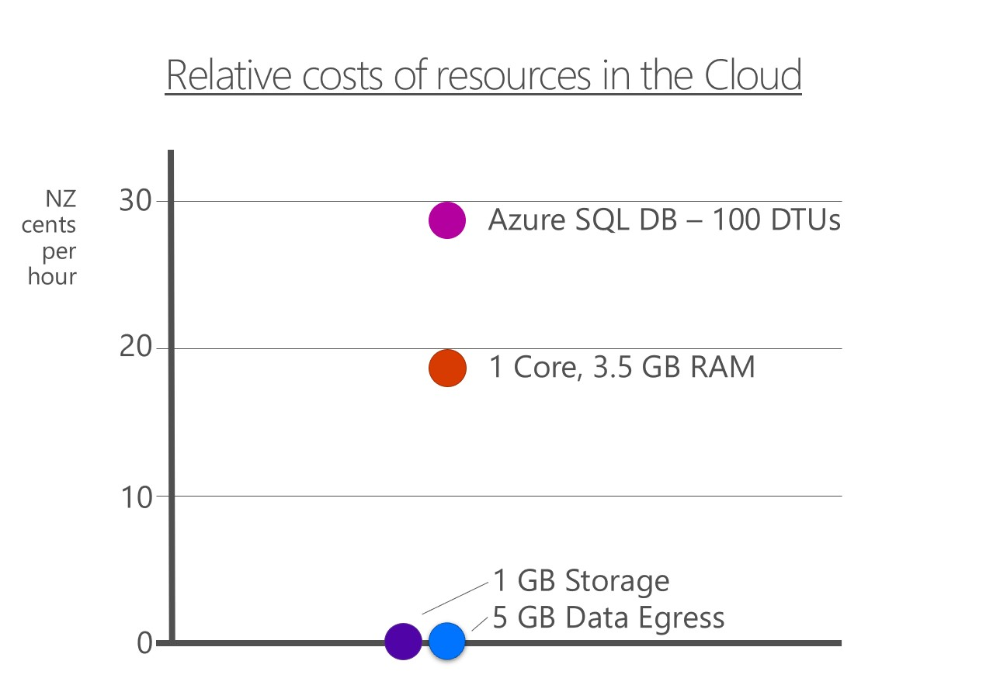

# Scaling the Database

## The four commodities of Cloud

Consider that _all services_ in the Cloud are composed of four commodities; **CPU**, **RAM**, **Storage**
and **Network** (bandwidth). CPU and RAM are usually bundled together and cost significantly more than
Storage and Network. Azure Blob Storage is composed of mostly storage and network with a small amount
of compute (CPU and RAM). Its cost is many times less than a more complex service like Azure SQL DB
as shown this chart:

While the numbers don't quite up it is true to say that storing data in Blob Storage is relatively cheaper
than storing data in SQL DB. This is because SQL (and all other RDBMS) use significant compute resources
(CPU and RAM) as well as high disk IOPs to be effective.

Moving a SQL Server to the Cloud exposes this incovenient truth, where services are charged by the resources
("commodities") they consume _at the time of consumption_.

## The single master problem

Consider a SQL Database in the Cloud to be complex form of Storage. Unlike Blob Storage which is mostly
storage with a small amount of

There are two inconvenient truths for relational database management systems that become apparent when
you move to the Cloud. All RDBMS suffer from these problems, not just SQL Server.
